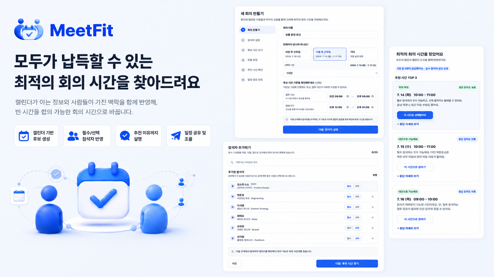

# MeetFit

6명의 동료가 1시간 회의 일정을 잡는 경험을 보여주는 정적 웹 앱 프로토타입입니다.
## Prototype Assumptions

- Google Calendar와 Google Workspace 연동은 목업 데이터로 시뮬레이션했습니다.
- 실제 이메일 발송은 하지 않지만, 주최자 확인 화면과 참석자 응답 화면을 분리해 실제 흐름처럼 볼 수 있게 했습니다.
- 추천 점수는 실제 알고리즘이 아니라 설계 원칙을 설명하기 위한 목업 기준입니다.

## Prototype
- 주최자 플로우: [MeetFit](https://meet-fit-six.vercel.app/)
- 참석자 응답 플로우: [MeetFit/participant](https://meet-fit-six.vercel.app/participant.html)

## 문제 정의

캘린더의 "빈 시간"은 회의하기 "최적의 시간"을 의미하지 않습니다.

여러 명의 회의를 잡을 때 주최자는 단순히 비어 있는 시간을 찾는 것이 아니라, 회의가 성립하는 조건과 모두가 납득할 수 있는 조건을 함께 판단해야 합니다. 기존 캘린더는 누가 꼭 참석해야 하는지, 선택 참석자는 어느 정도까지 고려해야 하는지, 점심 직후가 부담스러운지, 특정 요일에 외근 이동이 많은지, 앞뒤 연속되는 일정 때문에 회의 참석이 부담스러운지는 알려주지 않습니다.

MeetFit은 기존 캘린더가 잘 아는 일정 정보와 캘린더만으로는 알기 어려운 참석자의 맥락을 함께 반영해, 빈 시간을 모두가 납득할 수 있는 회의 시간으로 바꾸는 경험을 설계했습니다.

## 핵심 흐름

1. 회의 기본 정보를 입력합니다.
2. Google Workspace에서 불러온 동료 목업 데이터로 참석자를 검색해 추가하고, 필수/선택 참석을 구분합니다.
3. 구글 캘린더 기준으로 100% 불가능한 시간을 제외하고, 필수 참석자가 가능한 1시간 후보를 확인합니다.
4. 조율 요청 전 참석자와 TOP 3 후보를 최종 확인하고, 각 참석자에게 개인 일정과 겹치지 않는 응답 링크를 보냅니다.
5. 참석자는 후보별 가능/부담/어려움을 응답합니다.
6. 주최자는 참석 필요도와 부담 조건이 반영된 추천 시간을 확인합니다.
7. 주최자는 추천 이유를 근거로 판단하여 선택한 최종 회의 일정을 참석자에게 공유합니다.
8. 참석자는 확정된 회의 시간을 메일 또는 캘린더 초대로 확인합니다.

### 1. 사용자의 어떤 문제를 발견했나요? 그것이 왜 문제라고 생각했나요?

여러 명의 회의 일정에서 사용자가 겪는 본질적 문제는 ‘빈 시간 찾기’가 아니라 ‘그 시간이 회의하기 진짜 괜찮은지 판단하는 일’이라고 봤습니다. 캘린더는 바쁨/한가함은 알려주지만, 누가 꼭 참석해야 하는지, 선택 참석자는 어디까지 고려할지, 점심 직후나 외근 이동, 앞뒤 일정 부담 같은 맥락은 보여주지 않습니다. 그래서 주최자는 빈 시간을 찾고도 메신저로 다시 확인하고, 참석자는 정해진 뒤에야 부담을 말하게 됩니다. 일정 조율 과정이 캘린더, 메일, 메신저로 흩어져 합의 비용이 커지는 것이 핵심 문제라고 정의했습니다.

### 2. 그 문제를 어떻게 해결했나요?

MeetFit은 캘린더가 아는 정보와 사람이 말해야 하는 정보를 분리해 해결했습니다. 먼저 Google Calendar/Workspace 기반으로 회의, 휴가, 점심시간처럼 명확히 불가능한 시간을 제외하고, 주최자는 참석자를 필수/선택으로 구분합니다. 이후 필수 참석자가 가능한 TOP 3 후보만 추리고, 선택 참석자의 충돌이나 필수 참석자의 전후 부담은 추천 근거로 표시합니다. 참석자에게는 본인 일정과 겹치지 않는 후보만 담긴 응답 링크를 보내고, 가능/부담/어려움 같은 정성 응답을 수집합니다. 마지막에는 응답과 캘린더 조건을 함께 반영해 추천 이유를 보여주고, 주최자가 최종 시간을 선택해 참석자에게 공유합니다.

### 3. 왜 이 방식으로 설계했나요?

이 방식은 회사에서 이미 쓰는 캘린더를 대체하기보다, 캘린더가 놓치는 조율 판단을 보완하는 데 집중하기 위해 설계했습니다. 실제 회사에서는 이미 구글 캘린더를 사용하기 때문에, 사용자가 모든 일정을 다시 입력하게 하기보다 캘린더가 잘 아는 정보와 모르는 정보를 분리했습니다. 
캘린더가 아는 회의, 휴가, 점심시간은 자동으로 제외하고, 캘린더가 모르는 부담감과 선호만 사람에게 묻도록 했습니다.

필수 참석자는 회의 성립 조건으로, 선택 참석자는 참석 가능성을 높이는 신호로 분리해 우선순위를 명확히 했습니다. 즉, 필수 참석자와 선택 참석자를 같은 무게로 처리하지 않아 회의 성립 조건과 참석 중요도를 분리했습니다. 
또한 참석자에게는 자신의 일정과 겹치지 않는 후보만 보여줘 불필요한 응답 부담을 줄였고, 주최자에게는 후보별 근거와 응답 상세를 보여줘 왜 그 시간이 적합한지 설명 가능하게 했습니다.

각 단계의 CTA 직전에는 다음 단계에서 일어나는 일을 안내해,주최자가 흐름을 예측하고 이동할 수 있게 하였고,주최자/참석자 분리 플로우로 실제 업무 도구처럼 예측 가능한 사용 흐름을 만들었습니다.

## 설계 원칙

- 캘린더가 아는 정보는 자동화합니다: 회의, 휴가, 점심시간처럼 명확히 불가능한 시간은 먼저 제외합니다.
- 캘린더가 모르는 맥락만 사람에게 묻습니다: 점심 직후 부담, 외근 이동, 선호 시간처럼 정성적인 조건만 짧게 확인합니다.
- 회의 성립 조건과 참석 품질 조건을 분리합니다: 필수 참석자는 후보 생성의 기준으로, 선택 참석자는 추천 품질을 높이는 참고 신호로 반영합니다.
- 추천에는 근거를 함께 제공합니다: 주최자가 선택한 시간을 동료에게 설명할 수 있어야 합의가 쉬워집니다.

## 실행

제출 링크는 회의 주최자 플로우를 기준으로 구성했습니다. 조율 요청 단계에서 참석자가 받는 응답 화면도 함께 확인할 수 있도록 연결했습니다. 이 제품의 핵심 사용자는 회의 시간을 확정해야 하는 주최자이지만, 참석자가 한 번만 응답하고 자신의 조건이 반영되었다고 느끼는 경험도 함께 설계했습니다.

주최자 화면 : `[MeetFit](https://meet-fit-six.vercel.app/)`을 브라우저에서 열면 됩니다. 별도 빌드나 설치가 필요 없습니다.
회의 참석자 화면 : `[MeetFit/participant](https://meet-fit-six.vercel.app/participant.html)`을 브라우저에서 열면 됩니다. 별도 빌드나 설치가 필요 없습니다.

